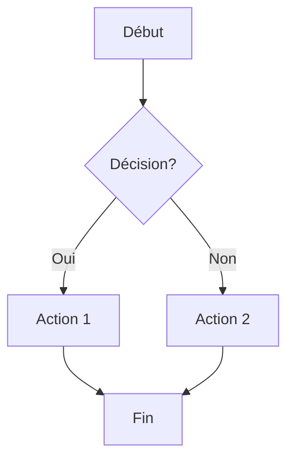

# Cartographie des Processus FINTECH
## MH INDUSTRIES - FIN'TECH INDUSTRIES

**Date de création** : 02 février 2026  
**Version** : 1.0  
**Auteur** : Manus AI - Consultant en Transformation Digitale  
**Contexte** : Suite à l'observation terrain IT (26-30 janvier 2026)

---

## 📋 Vue d'Ensemble

Ce projet de cartographie complète des processus FINTECH a pour objectif de documenter l'ensemble des flux opérationnels et d'identifier les opportunités d'amélioration, en particulier concernant l'intégration de l'ERP Clipper et la disponibilité de l'information.

La cartographie comprend **7 logigrammes visuels et modifiables** couvrant l'ensemble de la chaîne de valeur, de la réception des demandes clients jusqu'à la facturation, ainsi qu'une analyse détaillée du flux d'information et des problèmes d'intégration ERP.

---

## 📁 Structure du Projet

```
fintech_cartographie/
├── README.md                           # Ce fichier
├── PROPOSITIONS_SOLUTIONS.md           # Propositions détaillées et recommandations
├── logigrammes/                        # Fichiers sources modifiables
│   ├── 00_cartographie_globale.mmd
│   ├── 01_processus_commercial.mmd
│   ├── 02_processus_ordonnancement.mmd
│   ├── 03_processus_production.mmd
│   ├── 04_processus_controle_qualite.mmd
│   ├── 05_processus_emballage_facturation.mmd
│   └── 06_flux_information_erp.mmd
└── exports/                            # Images PNG générées
    ├── 00_cartographie_globale.png
    ├── 01_processus_commercial.png
    ├── 02_processus_ordonnancement.png
    ├── 03_processus_production.png
    ├── 04_processus_controle_qualite.png
    ├── 05_processus_emballage_facturation.png
    └── 06_flux_information_erp.png
```

---

## 🗺️ Les 7 Logigrammes

### 0. Cartographie Globale de l'Organisation

**Fichier** : `00_cartographie_globale.mmd`  
**Description** : Vue d'ensemble de l'organisation FINTECH avec les trois catégories de processus (Pilotage, Métier, Support) et les responsables associés.

**Contenu** :
- Processus de Pilotage : Groupe MH, Manager FIN'TECH, Qualité, HSE
- Processus Métier : Commerce, Méthodes & Industrialisation, Production (Traitement surface, Peinture liquide/poudre, Montage)
- Processus Support : Achats, Ressources Humaines, Affaires Financières

### 1. Processus Commercial

**Fichier** : `01_processus_commercial.mmd`  
**Description** : Flux complet de la réception des demandes clients jusqu'à l'enregistrement des commandes dans l'ERP.

**Étapes clés** :
- Réception et analyse des demandes clients
- Élaboration des devis (Excel + Clipper)
- Envoi et suivi des devis
- Réception et validation des commandes
- Enregistrement dans l'ERP

**Problèmes identifiés** :
- 🔴 Saisies manuelles multiples (risque erreur + chronophage)
- 🔴 Documentation non intégrée (fichiers dispersés réseau)
- 🔴 Fonctionnalités ERP sous-utilisées (pas d'exploitation EDI)

### 2. Processus Ordonnancement et Planification

**Fichier** : `02_processus_ordonnancement.mmd`  
**Description** : Flux de planification et d'ordonnancement de la production, de la commande validée jusqu'à l'approvisionnement au poste.

**Étapes clés** :
- Préparation des documents de production
- Planification initiale (dates entrée/sortie)
- Ordonnancement via Excel partagé
- Réception des pièces clients
- Approvisionnement au poste

**Problèmes identifiés** :
- 🔴 Excel partagé non intégré (pas de vue dynamique capacitaire)
- 🔴 Ordonnancement manuel (subjectivité + chronophage)
- 🔴 Appels appro par mail (rupture flux information)
- 🟡 Sur-contrôle possible (Méthodes + Ordo)

### 3. Processus Production

**Fichier** : `03_processus_production.mmd`  
**Description** : Flux de production complet couvrant la préparation de surface, le traitement, la peinture et le montage.

**Étapes clés** :
- Préparation de surface (dégraissage, décapage, sablage)
- Traitement de surface (réglage paramètres, passage four)
- Peinture liquide ou poudre (application, polymérisation)
- Montage / Assemblage

**Problèmes identifiés** :
- 🔴 Documentation papier dispersée (classeurs couleur non numériques)
- 🔴 Stock peinture déconnecté ERP (gestion parallèle Excel)
- 🔴 Appels appro par mail (pas d'intégration flux)
- 🟡 Consultation Excel partagé (ordonnancement non temps réel)

### 4. Processus Contrôle Qualité

**Fichier** : `04_processus_controle_qualite.mmd`  
**Description** : Flux de contrôle qualité final, gestion des non-conformités et retouches.

**Étapes clés** :
- Contrôle qualité final (visuel + technique)
- Délégation de contrôle à la production
- Gestion des non-conformités (émission AQ)
- Retouches selon dossier technique
- Validation finale

**Problèmes identifiés** :
- 🔴 Pas de dossier technique reprise (gamme FNC manquante)
- 🔴 Documentation qualité dispersée (réseau + classeurs papier)
- 🟡 Arbitrage subjectif sur-qualité (besoin critères objectifs)
- 🟡 Manuel système incomplet (procédures à consolider)

### 5. Processus Emballage et Facturation

**Fichier** : `05_processus_emballage_facturation.mmd`  
**Description** : Flux d'emballage, expédition et facturation des commandes terminées.

**Étapes clés** :
- Emballage adapté et étiquetage
- Organisation du transport
- Expédition et sortie stock
- Consolidation des coûts (matières, MO, énergie)
- Émission et envoi de la facture

**Problèmes identifiés** :
- 🔴 Consolidation coûts manuelle (Excel + Papier + ERP)
- 🔴 Pas d'automatisation calculs (chronophage et erreurs)
- 🟡 Vigilance spécifiques ERP (intégration forte à préserver)
- 🟡 Regroupement factures manuel (complexité gestion)

### 6. Flux d'Information et Intégration ERP

**Fichier** : `06_flux_information_erp.mmd`  
**Description** : Vue systémique du flux d'information montrant la fracture numérique entre l'ERP et les outils parallèles.

**Contenu** :
- Input : Saisies manuelles multiples
- ERP Core : Base de données centrale (commandes, articles, stocks, facturation)
- Outils parallèles : Excel ordonnancement, Excel stocks peinture, fichiers réseau, classeurs papier, mails
- Output : Reporting manuel, KPI statiques

**Fracture numérique identifiée** :
- 🔴 Saisies manuelles multiples (risque erreur + temps perdu)
- 🔴 Outils parallèles non intégrés (perte productivité)
- 🔴 Documentation dispersée (accessibilité difficile)
- 🔴 Reporting manuel (pas de pilotage temps réel)

---

## 🛠️ Formats et Modification

### Format des Logigrammes

Tous les logigrammes sont créés au format **Mermaid** (`.mmd`), un langage de description de diagrammes textuel qui présente plusieurs avantages :

**Modifiable facilement** : Les fichiers `.mmd` sont de simples fichiers texte qui peuvent être édités avec n'importe quel éditeur de texte. Vous pouvez modifier les étapes, ajouter des éléments, ou changer les couleurs directement dans le code.

**Versionnable** : Le format texte permet d'utiliser Git pour suivre l'évolution des logigrammes dans le temps, comparer les versions, et collaborer efficacement.

**Portable** : Les fichiers Mermaid peuvent être rendus dans de nombreux outils (GitHub, GitLab, Notion, Obsidian, VS Code, etc.) sans nécessiter de logiciel propriétaire.

**Régénérable** : À tout moment, vous pouvez régénérer les images PNG à partir des fichiers `.mmd` en utilisant l'utilitaire `manus-render-diagram`.

### Comment Modifier un Logigramme

1. Ouvrez le fichier `.mmd` correspondant dans un éditeur de texte
2. Modifiez le contenu selon la syntaxe Mermaid (voir [documentation Mermaid](https://mermaid.js.org/))
3. Régénérez l'image PNG avec la commande :
   ```bash
   manus-render-diagram chemin/vers/fichier.mmd chemin/vers/sortie.png
   ```

### Exemple de Syntaxe Mermaid



---

## 🎯 Problèmes Identifiés par Priorité

### Priorité Critique (🔴)

1. **Saisies manuelles multiples** (Processus Commercial)
   - Impact : Fort
   - Effort : 1 Formation
   - Quick Win Score : 33

2. **Excel ordonnancement non intégré** (Processus Ordonnancement)
   - Impact : Fort
   - Effort : 3 Projet
   - Empêche vue dynamique du capacitaire

3. **Documentation dispersée** (Tous processus)
   - Impact : Moyen
   - Effort : 2 Mini-chantier
   - Accessibilité difficile au poste de travail

4. **Stocks peinture déconnectés ERP** (Processus Production)
   - Impact : Moyen
   - Effort : Intégration
   - Empêche analyse des coûts

5. **Reporting manuel chronophage** (Flux Information)
   - Impact : Moyen
   - Effort : 2 Mini-chantier
   - Pas de KPI dynamiques

### Priorité Moyenne (🟡)

1. **Sur-contrôle Méthodes + Ordo** (Processus Ordonnancement)
2. **Arbitrage subjectif sur-qualité** (Processus Contrôle Qualité)
3. **Manuel système incomplet** (Processus Contrôle Qualité)
4. **Regroupement factures manuel** (Processus Facturation)

---

## 📊 Statistiques du Recueil Terrain

| Indicateur | Valeur |
|------------|--------|
| **Observations totales** | 23 |
| **Quick Wins identifiés** | 9 |
| **Processus cartographiés** | 7 |
| **Problèmes critiques** | 5 |
| **Problèmes moyens** | 4 |
| **Distribution par atelier** | Supports: 9, Poudre: 4, Liquide: 3 |

---

## 🚀 Prochaines Étapes Recommandées

### Étape 1 : Validation de la Cartographie

Présenter la cartographie aux parties prenantes (Direction, Responsables de processus) pour validation et ajustements éventuels.

### Étape 2 : Analyse du Support ERP

Se connecter au support Jira de l'ERP Clipper pour identifier les fonctionnalités disponibles mais sous-utilisées qui pourraient résoudre les problèmes identifiés.

### Étape 3 : Priorisation des Quick Wins

Valider la priorisation des Quick Wins avec l'équipe et définir un plan d'action détaillé pour la Vague 1 (0-3 mois).

### Étape 4 : Choix de la Solution de Documentation

Décider entre les trois options proposées :
- Option A : Création d'un Skill Manus réutilisable
- Option B : Développement d'une application web interactive
- Option C : Documentation statique enrichie (base minimale)

### Étape 5 : Lancement de la Vague 1

Démarrer les Quick Wins d'intégration ERP prioritaires :
- Formation enregistrement commandes (EDI)
- Intégration gammes et dossiers techniques
- Paramétrage documentations qualité

---

## 📞 Contact et Support

Pour toute question ou demande d'évolution de cette cartographie, veuillez contacter :

**Projet Manus** : [https://manus.im/app/project/m4FeBSXuFmMPpsF5S8pzWe](https://manus.im/app/project/m4FeBSXuFmMPpsF5S8pzWe)

**Documentation source** : Google Drive - Dossier FINTECH_Exploitation

---

## 📄 Licence et Confidentialité

Ce document et les logigrammes associés sont la propriété de **MH INDUSTRIES - FIN'TECH INDUSTRIES**.

**Confidentialité** : Diffusion restreinte - Usage interne uniquement

---

*Document généré par Manus AI - Consultant en Transformation Digitale*  
*Version 1.0 - 02 février 2026*
